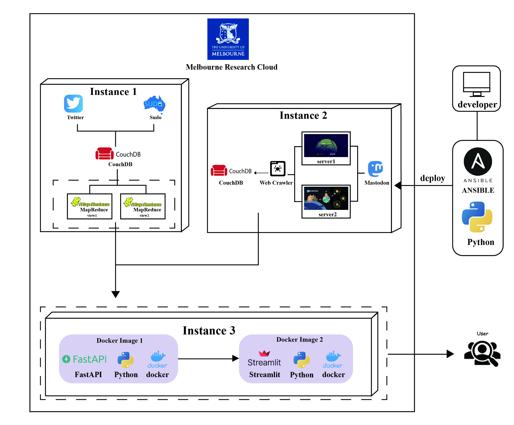

# CCC_Assignment2
Group33 Assignment2

This project requires our team to develop a front-end web application based on the cloud system
(UniMelb Research Cloud) to tell and visualize interesting life stories in Australia and improve our
understanding of Australian life.

## Frontend website

(http://172.26.129.111:8501/)

The front-end of this project utilizes Streamlit, an open-source application framework, for constructing interactive, data-driven applications with Python scripts and supports complex objects and models. Streamlit is characterized by its real-time interactivity, expedited development process, and it simplifies the deployment of data-driven web applications. In this project, we optimized the efficiency of data requests from the backend by using Streamlit's internal plugins, thus improving user experience.


## Video
Part one： \url

Part two:  [](https://youtu.be/TrJ6uQKA-rM)


## Architecture


## Deployment user guide
# CCC_Assignment2

## Setup and Execution with Ansible

This repository includes an Ansible script (`Ansible.yaml` in the `Data` folder) for setting up the required environment and running the Python application. The script automates the following tasks:

1. Install Python3
2. Install pip for Python3
3. Install Mastodon and CouchDB Python libraries using pip
4. Install Transformers library using pip
5. Install Scipy library using pip
6. Install PyTorch library using pip
7. Run the Python application `Mastodon.py` in a detached mode

To execute the Ansible script, navigate to the directory containing the script and run the following command in the terminal:

```
$ ansible-playbook Ansible.yaml
```
#### Backend
```
$ pip3 install -r environment.txt

$ python3 main.py
```

#### Frontend
```
$ pip3 install -r requirement.txt

$ python3 app.py
```
